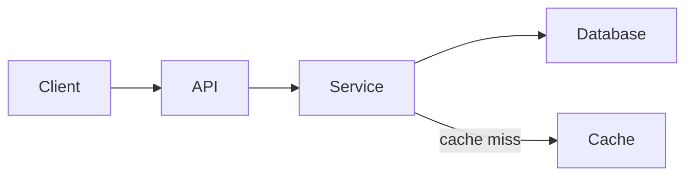

# Diagrams

Use Mermaid for architecture, flows, sequences, and state diagrams when a diagram conveys more than prose would.

## CLI Rendering Constraints

The Mermaid renderer in this CLI converts diagrams to ASCII art. Violations cause broken output (ghost nodes, raw CSS text, misaligned arrows).

**Forbidden — never use:**
- `style` directives
- `classDef` / `class` directives
- Inline color or fill declarations
- Complex node shapes: `[(database)]`, `{{hexagon}}`, `>asymmetric]`

**Required — always use:**
- Simple rectangular nodes: `A`, `A[Label]`
- Diamond decisions: `A{Decision}`
- Plain edge labels: `A -->|label| B`
- Standard diagram types: `flowchart`, `sequenceDiagram`, `stateDiagram-v2`

## Example

When a plain text structure or table is clearer than a diagram, prefer that instead.
