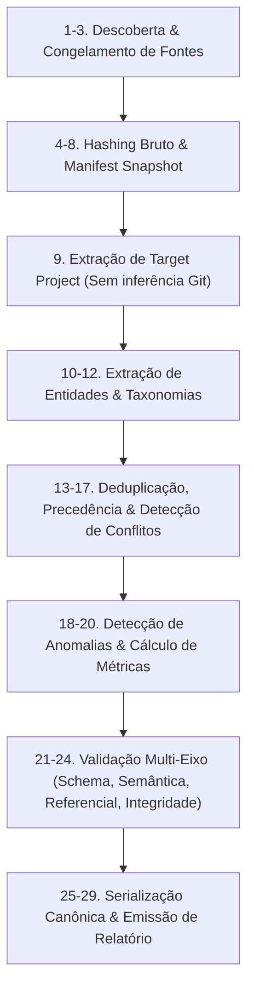

# `audit-normalize`

## 1. Identidade da Skill

`audit-normalize` é uma Skill de Engenharia de Dados e Compilação Estrutural voltada exclusivamente para a normalização, validação e rastreabilidade de dados de auditoria técnica.

> [!IMPORTANT]
> `audit-normalize` **NÃO É UMA SKILL DE AUDITORIA** e **NÃO AUDITA PROJETOS**.
> A auditoria técnica já ocorreu previamente por agentes especializados (como `project-audit`) ou ferramentas externas. O propósito exclusivo desta Skill é receber documentos Markdown existentes contendo conclusões de auditoria, interpretar sua estrutura, preservar proveniência, aplicar políticas determinísticas de precedência e merge, calcular métricas e gerar datasets canônicos validados.

---

## 2. Quando a Skill é Acionada

A Skill é acionada nas seguintes situações:
- Após a conclusão de uma auditoria técnica (e.g., `project-audit`), quando documentos Markdown de auditoria estiverem disponíveis para consumo.
- Quando o usuário solicita a conversão, consolidação, estruturação ou normalização de relatórios de auditoria em Markdown para formatos consumíveis por etapas posteriores como `report-publish` (publicação de relatórios editoriais) ou `issue-forge` (geração de tickets/issues).
- Quando for necessário verificar conformidade semântica, integridade referencial ou conformidade estrutural de um dataset `report_data.json` existente contra o contrato canônico.

---

## 3. O que a Skill Recebe

A Skill opera sobre um ou mais documentos Markdown já existentes contendo resultados de auditoria.

### Entradas Típicas:
- Ledgers de auditoria (e.g., `03_audit_ledger.md`, `audit-ledger.md`, `ledger.md`)
- Relatórios analíticos (e.g., `02_analytical_report.md`, `security-review.md`, `audit.md`)
- Manifestos de cobertura e aplicabilidade (e.g., `01_coverage_manifest.md`, `coverage.md`)
- Modelos de ameaça e inventários de ativos (e.g., `00_inventory_and_threat_model.md`, `inventory.md`, `threat-model.md`)
- Revisões externas ou de terceiros (e.g., `external-review.md`, `database-review.md`)

A Skill não depende exclusivamente de nomes de arquivos rígidos; ela utiliza análise semântica de cabeçalhos, tabelas e estruturas textuais para identificar o papel da fonte (`source_role`).

---

## 4. O que a Skill Produz

A execução determinística gera 4 artefatos normativos no diretório de saída (por padrão `docs/audit/normalized/`):

1. `report_data.json`: O dataset JSON canônico consolidado, governado pelo JSON Schema Draft 2020-12.
2. `report_data.schema.json`: Cópia local do contrato estrutural autoritativo para consumo autônomo por ferramentas a jusante.
3. `validation_report.json`: Relatório de validação detalhado contendo os resultados das validações de Schema, Semântica, Integridade Referencial e Integridade de Hashes.
4. `source_manifest.json`: Manifesto de proveniência registrando cada arquivo de entrada, seu hash SHA-256 sobre os bytes brutos e o `snapshot_id` canônico da execução.

---

## 5. Fluxo Operacional

A pipeline determinística executa em 29 etapas canônicas:



1. **Descoberta de Fontes**: Localiza arquivos `.md` nos caminhos fornecidos e exclui artefatos de saída ou temporários.
2. **Congelamento do Conjunto**: Nenhum arquivo novo é adicionado durante a execução.
3. **Ordenação Canônica**: Ordena caminhos relativos de forma determinística independente do filesystem.
4. **Cálculo de Hashes**: Calcula o SHA-256 exato sobre os bytes brutos não modificados de cada fonte.
5. **Classificação de Papel**: Classifica cada fonte em um `source_role` normativo (`AUDIT_LEDGER`, `ANALYTICAL_REPORT`, `INVENTORY`, etc.).
6. **Snapshot Canônico**: Serializa a lista de fontes de forma determinística e calcula o `snapshot_id` (`sha256:<hex>`).
7. **Extração de Target Project**: Extrai repositório, commit, branch e versões explicitamente descritos.
8. **Extração de Entidades**: Identifica findings, controls, applicability, inspections, limitations e references.
9. **Mapeamento de Taxonomias**: Normaliza severidades (e.g. Critical -> P0), tipos e status para enums formais.
10. **Deduplicação e Precedência**:
    - Agrupa findings por ID e verifica compatibilidade semântica.
    - Aplica merge não destrutivo: preserva valores conhecidos diante de ausências.
    - Em divergências de valores entre fontes: aplica a política de precedência por ranking de papéis.
    - Em empates de precedência: preserva o conflito não resolvido (`state: CONFLICT`, `value: null`, `conflict_id: CONFLICT-XXX`).
11. **Derivação de Métricas**: Calcula contagens e distribuições de severidade exclusivamente a partir dos arrays normalizados.
12. **Validação**: Executa o validador independente em todos os 4 eixos contratuais.
13. **Emissão de Artefatos**: Grava os arquivos canônicos formatados deterministicamente.

---

## 6. Regras de Preservação de Significado

1. **Proibição de Julgamento Técnico**:
   - Nunca aumentar ou rebaixar a severidade de um finding com base em julgamento próprio.
   - Nunca alterar o status de um finding (e.g., transformar `PROBABLE` em `CONFIRMED`) sem evidência documental.
2. **Recomendação ≠ Finding**:
   - Um parágrafo de recomendação ou sugestão de melhoria nunca deve ser transformado em um finding novo.
3. **Ausência ≠ Confirmação**:
   - A ausência de findings em uma inspeção nunca autoriza classificar a área como "isenta de falhas" (`PROTECTED` ou `SECURE`).
   - A ausência de finding não implica `NOT_APPLICABLE`.
4. **Similaridade Textual Isolada Não Autoriza Merge**:
   - Duas descrições textualmente semelhantes em arquivos distintos só podem sofrer merge se houver correspondência inequívoca de identidade (ID explícito idêntico compatível ou mesma localização `file + line/range` + mesma categoria e tipo).
5. **Precedência e Resolução Explícita**:
   - `AUDIT_LEDGER` (rank 1) > `ANALYTICAL_REPORT` (rank 2) > `INVENTORY`/`THREAT_MODEL`/`COVERAGE_MANIFEST` (rank 3) > `EXTERNAL_REVIEW` (rank 4).
   - Menor valor numérico indica maior precedência.
   - Todo conflito resolvido registra a política aplicada e a fonte vencedora no histórico do conflito.
   - Empates geram conflitos não resolvidos e nunca utilizam fallbacks proibidos como "maior severidade vence", "primeira ocorrência vence" ou "última ocorrência vence".

---

## 7. Limitações

- A Skill processa estritamente a documentação fornecida; não consulta repositórios remotos, não executa ferramentas de linting ou SAST no projeto, e não inspeciona o filesystem do código-fonte para inferir achados.
- Se o projeto auditado não fornecer informações como commit ou branch na documentação de entrada, esses campos permanecerão formalmente como `NOT_PROVIDED_BY_SOURCE`.
- Fontes em formatos não-Markdown (e.g., binários, imagens, planilhas proprietárias) são ignoradas pelo processo de extração textual.

---

## 8. Instalação e Execução

O `audit-normalize` é empacotado como um pacote Python padrão (`src/audit_normalize`), fornecendo executáveis de linha de comando (`audit-normalize` e `audit-validate`), suporte à execução como módulo (`python -m audit_normalize`) e API Python importável.

### 8.1. Instalação

```bash
# Instalação padrão no ambiente virtual
pip install ./audit-normalize

# Modo de desenvolvimento
pip install -e "./audit-normalize[test]"
```

### 8.2. CLI: Normalização Completa (`audit-normalize`)

```bash
# Execução padrão (procura docs/audit e gera docs/audit/normalized)
audit-normalize

# Especificando diretório de entrada e saída
audit-normalize -i caminho/para/audit -o caminho/para/saida

# Especificando múltiplos arquivos individuais
audit-normalize -i relatorio1.md relatorio2.md -o output/

# Modo estrito (falha se houver qualquer aviso/anomalia não bloqueante)
audit-normalize -i docs/audit -o docs/audit/normalized --strict

# Execução alternativa como módulo Python
python3 -m audit_normalize -i docs/audit -o docs/audit/normalized
```

### 8.3. CLI: Validação Independente (`audit-validate`)

```bash
# Validar um report_data.json existente contra o contrato canônico
audit-validate caminho/para/report_data.json

# Validando com verificação de integridade de arquivos em disco
audit-validate docs/audit/normalized/report_data.json --base-dir .
```

### 8.4. Uso via API Python

```python
from audit_normalize import normalize, AuditDataValidator

# Executar a pipeline de normalização
val_report = normalize(
    input_paths=["docs/audit"],
    output_dir="docs/audit/normalized",
    strict=False,
)

# Ou instanciar o validador independente
import json
with open("references/report_data.schema.json") as f:
    schema = json.load(f)
with open("docs/audit/normalized/report_data.json") as f:
    data = json.load(f)

validator = AuditDataValidator(schema)
results = validator.validate_all(data, base_dir=".")
```

---

## 9. Validações

O processo de validação é desacoplado e cobre 4 dimensões obrigatórias:

1. **JSON Schema**: Valida sintaxe e restrições estruturais contra `report_data.schema.json` utilizando o validador oficial Draft 2020-12.
2. **Validação Semântica**:
   - `metrics.findings_total == len(findings)`
   - Contagens de severidade (`P0`, `P1`, `P2`, `P3`, `INFO`) coincidem exatamente com a soma das severidades dos achados.
   - Estados de informação satisfazem seus contratos (`PRESENT` exige valor não nulo; `NOT_DETERMINABLE` exige `reason`; `CONFLICT` exige `conflict_id`).
   - `NOT_FOUND` é estritamente proibido como status de finding.
   - Em localizações com range, `line_end >= line_start`.
3. **Validação Referencial**:
   - Todo `source_id` em proveniências e conflitos existe em `audit_snapshot.sources`.
   - Todo `conflict_id` referenciado em campos aponta para uma entrada existente em `conflicts[]`.
   - Conflitos com `finding_id` apontam para achados existentes.
4. **Validação de Integridade**:
   - Hashes SHA-256 batem com os bytes dos arquivos em disco.
   - O `snapshot_id` coincide com o hash do manifesto canônico.

---

## 10. Comportamento Diante de Entrada Inválida ou Ausente

- **Ausência de Fontes Markdown**:
  - A Skill aborta imediatamente emitindo mensagem de erro explícita.
  - Não executa auditoria de código, não inspeciona o repositório e não gera findings sintéticos.
- **Formato Inválido ou Corrompido**:
  - Registra anomalia formal do tipo `SOURCE_FORMAT_ANOMALY`.
  - Se os dados mínimos necessários puderem ser extraídos com segurança, prossegue com estado `VALID_WITH_WARNINGS`.
  - Se a falha violar regras estruturais obrigatórias do Schema, o dataset é classificado como `INVALID` e a execução é interrompida com código de erro.
